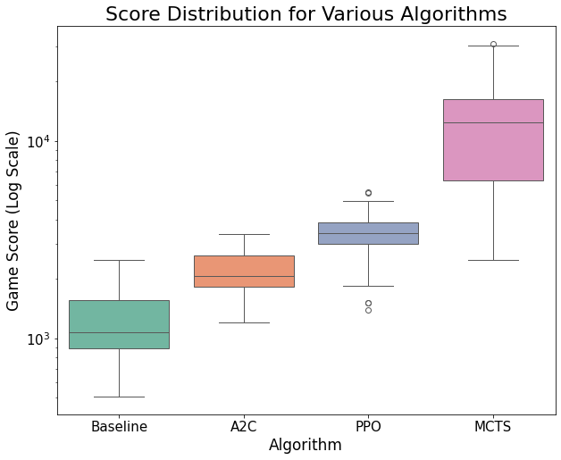

## Final Video Summary

## Project Summary
Ultimate 2048 aims to explore and compare the efficacy of various reinforcement learning (RL) algorithms in playing 2048, a puzzle game on a 4x4 grid where tiles of equal numbers are merged to create larger tiles until the 2048 tile is reached. Tiles of values 2 and 4 appear at random in empty spaces on the grid. As there have been a variety of previous attempts across different contexts showing the surprising difficulty of this task, our focus is to (1) find and optimize an algorithm that can learn to reach the 2048 tile, and (2) perform a comparative analysis of Policy Gradient Algorithms - more specifically, Proximal Policy Optimization (PPO) and Advantage Actor-Critic (A2C) - and Monte Carlo Tree Search (MCTS) for this game under a single, controlled setting.

The 2048 game is great AI/ML task because it has an enormous number of possible board configurations, and success requires long-term strategies making it infeasible to use brute force methods. With the added complexity of random tiles appearing after each move, this becomes a perfect environment for reinforcement learning algorithms which can learn to make decisions under uncertain circumstances. Further, because the game's scoring system is non-linear with points increasing more quickly as the tiles get larger, machine learning is necessary to balance the reward function and its coefficients as the game progresses.

We are using a Python implementation of the 2048 game in order to use a 2D array game state as input.  Each time the Python simulation calls the currently in-use model, the model's output consists of two parts: (1) one of four possible next moves: up, down, left, or right and (2) an array of length four with the model's confidence in each move at that particular point in time, expressed as a probability. By conducting this experiment, we hope to discover the strengths and weaknesses of each approach which can inform future studies regarding RL for solving complex, real-world problems involving randomness, spatial reasoning, and long-term planning.

## Approach
Our approach can be broken down into the implementation and evaluation of three different AI/ML Algorithms, which we evaluate under the same success criteria. These models were selected because of their documented strengths in solving similar tasks [1-5], and refined through the recommendations of Professor Fox in our initial proposal meeting. We also implemented a baseline model to serve as a point of comparison.


#### Baseline
Our baseline model simply selects a random move (up, down, left, or right) for each turn. This strategy tends to succeed early in the game when the board is fairly empty and tiles' values are small. However, as the game progresses, random moves do not create any order on the board and thus fails. Therefore, this is a good baseline to check that our models are using long-term planning and reaching success in later stages of the game.


#### Monte Carlo Tree Search (MCTS)
Monte Carlo Tree Search is a search algorithm that balances exploration (trying new actions to discover long-term strategies) and exploitation (choosing the best-known action based on past experiences). The process follows 4 main steps: selection, expansion, simulation, and backpropagation. For 2048, MCTS constructs a search tree where nodes represent game states, and edges represent moves (up, down, left, right) linking those states. The algorithm iteratively simulates games from different starting points, updating its confidence in the different possible moves to maximize long-term success.

MCTS samples game trajectories by simulating rollouts from the current state. At each step, it selects an action using Upper Confidence Bound for Trees (UCT) [6]. This is defined as:

$$
\mathcal{UCT}(s, a) = Q(s, a)+ C \sqrt{\frac{\ln \mathcal{N}(s)}{\mathcal{N}(s, a)}}
$$

Q(s, a) represents exploitation (favoring high rewards), and the second term encourages exploration (prioritizing less-tried actions). C is a constant to adjust the amount of exploration [6]. ln N(s) and N(s, a) represent the number of times the parent and child nodes have been visited, respectively. Further, we want to ensure that the model keeps the largest tiles in the bottom left corner to keep the board organized. To do this, we first applied a heavy penalty to actions moving right which significantly affects the board organization and a moderate penalty to actions moving up since it should be done sparingly. We also created distance functions using Manhattan distance measuring how far the largest and second-largest tiles are from the bottom left corner and the spot above the corner, respectively. Heavy penalties were applied if these distances grew. We did not implement a penalty for the third-largest tile as this restricted the model's moves too much, worsening its performance. Therefore, our final equation for selecting the best move from each rollout is:

$$
\mathcal{UCT}(s, a) = Q(s, a) + 1.5 \sqrt{\frac{\ln N(s)}{N(s, a)}} - 120000 \cdot \mathcal{I}_{right} - 20000 \cdot \mathcal{I}_{up} - 100000 \cdot D_\text{corner} - 100000 \cdot D_\text{above corner}
$$

To use this model in 2048, we represent states as a 4x4 array and define actions as the 4 possible moves. The reward function incentivizes tile merging and penalizes game termination. Instead of full rollouts, which can be hundreds of moves, we limited each to have a maximum of 35 steps as increasing the number had minimal benefits. We also optimized the number of trials/simulations by finding the average score of 10 games for 10, 30, 60, 100, and 130 simulations for each rollout. We found that using 60 simulations significantly outperformed other values. Additionally, we changed the exploration-expoitation tradeoff constant from 1 to 1.5 to slightly encourage more exploration before choosing the best move [1]. The high-level pseudocode describing the flow of this algorithm is shown below.

```
while game is not over:
    create root node with current game state

    repeat for 60 simulations:
        start at root node
        while current node is not leaf:
            select best child using UCT(s, a)
            move to selected child

        if current node not fully expanded:
            create new child node for untried move

        simulate playout of 35 moves from node
        
        backpropagate rewards and visit counts for all nodes in path
    
    choose most visited child of root
    apply chosen move to game state        
```

MCTS is found to significantly outperform other models in 2048 by simulating many rollouts to identify high-reward, long-term action sequences. However, this advantage comes with high computational costs. MCTS requires much more time per move than policy gradient methods, and the large tree growth relies on much more memory than other methods. In our optimal model using 60 simulations per rollout, the model only performs around 90 moves per minute compared to Proximal Policy Optimization which can perform over moves per minute. This makes it difficult to perform repeated testing as efficiently as other models, but because 2048 does not have a time limit and MCTS displays a high success rate, the computational cost is worth it. Additionally, with our penalties for making undesirable moves and creating a disorganized board, this model tends to make smart, long-term moves and does not show signs of overfitting.


#### Proximal Policy Optimization (PPO)


#### Advantage Actor-Critic (A2C)

## Evaluation
<div style="text-align: center;">

</div>

## Resources Used
Libraries:
- General Python Libraries: concurrent, copy, json, os, Pygame, random, sys
- AI/ML/Computing Libraries: Keras, Matplotlib, NumPy, TensorFlow

2048 in Python:
- Game Logic/Rendering (game_logic.py, game_renderer.py): https://github.com/scar17off/ai-2048
- 2048 Python Game Simulation (run_simulation.py): Modified version of the original file "ai_play.py" in https://github.com/scar17off/ai-2048/tree/main

Algorithm Implementation Approaches:
- Monte Carlo Tree Search (MCTS) approach (mcts.py): inspired by the implementation for Tic-Tac-Toe at https://www.stephendiehl.com/posts/mtcs/
- Proximal Policy Optimization (PPO) approach (ppo.py): inspired by the implementation of PPO at https://iclr-blog-track.github.io/2022/03/25/ppo-implementation-details/
- Advantage Actor-Critic (A2C) approach (a2c.py): inspired by the implementation for CartPole at https://www.geeksforgeeks.org/actor-critic-algorithm-in-reinforcement-learning/

Papers and Other Resources:
- [1] Goenawan, N., Tao, S., Wu, K. "What’s in a Game: Solving 2048 with Reinforcement Learning". https://web.stanford.edu/class/aa228/reports/2020/final41.pdf
- [2] https://github.com/haakon8855/mcts-reinforcement-learning
- [3] https://github.com/hsiehjackson/Deep-Reinforcement-Learning-on-Atari-Games
- [4] https://njustesen.github.io/botbowl/a2c.html
- [5] Guei, H. "On Reinforcement Learning for the Game of 2048". https://arxiv.org/abs/2212.11087
- [6] https://www.chessprogramming.org/UCT
- https://blogs.oracle.com/ai-and-datascience/post/reinforcement-learning-q-learning-made-simple
- https://medium.com/@dixitaniket76/advantage-actor-critic-a2c-algorithm-explained-and-implemented-in-pytorch-dc3354b60b50

AI Tools:
- Used ChatGPT in line with other online resources to gain a better understanding of the algorithms before implementation (i.e. had the chatbot summarize, give use case examples, etc.)
- Used ChatGPT to aid in the fixing of minor bugs during implementation process