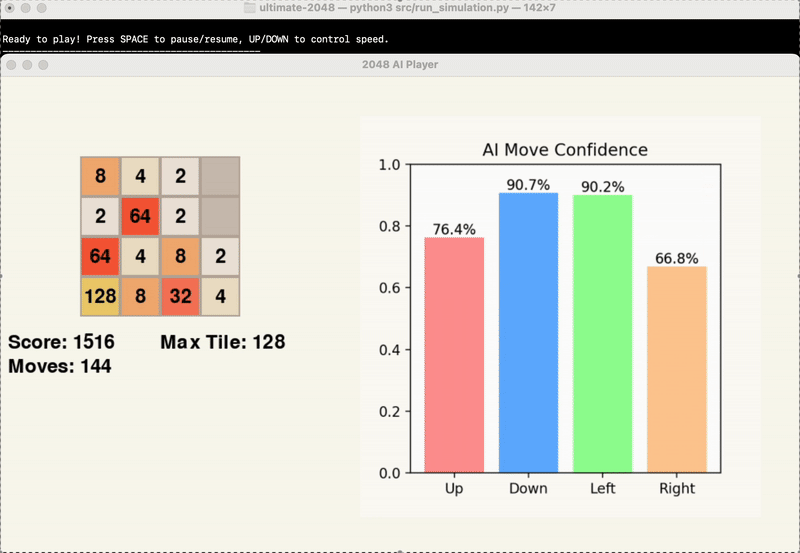

## Final Video Summary

## Project Summary
Ultimate 2048 aims to explore and compare the efficacy of various reinforcement learning (RL) algorithms in playing 2048: a puzzle game on a 4x4 grid where tiles of equal numbers are merged to create larger tiles indefinitely. While the game can technically go on forever, successfully reaching the 2048 tile is considered winning. Tiles of values 2 and 4 appear at random in empty spaces on the grid. If the board fills up and no additional moves are possible, the game is over. As there have been a variety of previous attempts across different contexts showing the surprising difficulty of this task, our focus is to (1) find and optimize an algorithm that can learn to reach the 2048 tile, and (2) perform a comparative analysis of Policy Gradient Algorithms - more specifically, Proximal Policy Optimization (PPO) and Advantage Actor-Critic (A2C) - and Monte Carlo Tree Search (MCTS) for this game under a single, controlled setting.

The 2048 game is considerable AI/ML task because it has an enormous number of possible board configurations - an infinite amount if the game is able to infinitely progress - and success requires long-term strategies making it infeasible to use brute force methods. With the added complexity of random tiles appearing after each move, this becomes a perfect environment for reinforcement learning algorithms which can learn to make decisions under uncertain circumstances. Further, because the game's scoring system is non-linear with points increasing more quickly as the tiles get larger, machine learning is necessary to balance the reward function and its coefficients as the game progresses.

We are using a Python implementation of the 2048 game in order to use a 2D array game state as input.  Each time the Python simulation calls the currently in-use model, the model's output consists of two parts: (1) one of four possible next moves: up, down, left, or right and (2) an array of length four with the model's confidence in each move at that particular point in time, expressed as a probability. By conducting this experiment, we hope to discover the strengths and weaknesses of each approach which can inform future studies regarding RL for solving complex, real-world problems involving randomness, spatial reasoning, and long-term planning.

## Approach
Our approach can be broken down into the implementation and evaluation of three different AI/ML Algorithms, which we evaluate under the same success criteria. These models were selected because of their documented strengths in solving similar tasks [1-5], and refined through the recommendations of Professor Fox in our initial proposal meeting. We also implemented a baseline model to serve as a point of comparison.


#### Baseline
Our baseline model simply selects a random move (up, down, left, or right) for each turn. This strategy tends to succeed early in the game when the board is fairly empty and tiles' values are small. However, as the game progresses, random moves do not create any order on the board and thus fails. Therefore, this is a reliable baseline to check that our models are using long-term planning and reaching success in later stages of the game.


#### Monte Carlo Tree Search (MCTS)
Monte Carlo Tree Search is a search algorithm that balances exploration (trying new actions to discover long-term strategies) and exploitation (choosing the best-known action based on past experiences). The process follows 4 main steps: selection, expansion, simulation, and backpropagation. For 2048, MCTS constructs a search tree where nodes represent game states, and edges represent moves (up, down, left, right) linking those states. The algorithm iteratively simulates games from different starting points, updating its confidence in the different possible moves to maximize long-term success.

MCTS samples game trajectories by simulating rollouts from the current state. At each step, it selects an action using Upper Confidence Bound for Trees (UCT) [6]. This is defined as:

$$
\mathcal{UCT}(s, a) = Q(s, a)+ C \sqrt{\frac{\ln \mathcal{N}(s)}{\mathcal{N}(s, a)}}
$$

Q(s, a) represents exploitation (favoring high rewards), and the second term encourages exploration (prioritizing less-tried actions). C is a constant to adjust the amount of exploration [6]. ln N(s) and N(s, a) represent the number of times the parent and child nodes have been visited, respectively. Further, we want to ensure that the model keeps the largest tiles in the bottom left corner to keep the board organized. To do this, we first applied a heavy penalty to actions moving right which significantly affects the board organization and a moderate penalty to actions moving up since it should be done sparingly. We also created distance functions using Manhattan distance measuring how far the largest and second-largest tiles are from the bottom left corner and the spot above the corner, respectively. Heavy penalties were applied if these distances grew. We did not implement a penalty for the third-largest tile as this restricted the model's moves too much, worsening its performance. Therefore, our final equation for selecting the best move from each rollout is:

$$
\mathcal{UCT}(s, a) = Q(s, a) + 1.5 \sqrt{\frac{\ln N(s)}{N(s, a)}} - 120000 \cdot \mathcal{I}_{right} - 20000 \cdot \mathcal{I}_{up} - 100000 \cdot D_\text{corner} - 100000 \cdot D_\text{above corner}
$$

To use this model in 2048, we represent states as a 4x4 array and define actions as the 4 possible moves. The reward function incentivizes tile merging and penalizes game termination. Instead of full rollouts, which can be hundreds of moves, we limited each to have a maximum of 35 steps as increasing the number had minimal benefits. We also optimized the number of trials/simulations by finding the average score of 10 games for 10, 30, 60, 100, and 130 simulations for each rollout. We found that using 60 simulations significantly outperformed other values. Additionally, we changed the exploration-expoitation tradeoff constant from 1 to 1.5 to slightly encourage more exploration before choosing the best move [1]. The high-level pseudocode describing the flow of this algorithm is shown below.

```
while game is not over:
    create root node with current game state

    repeat for 60 simulations:
        start at root node
        while current node is not leaf:
            select best child using UCT(s, a)
            move to selected child

        if current node not fully expanded:
            create new child node for untried move

        simulate playout of 35 moves from node
        
        backpropagate rewards and visit counts for all nodes in path
    
    choose most visited child of root
    apply chosen move to game state        
```

MCTS is found to significantly outperform other models in 2048 by simulating many rollouts to identify high-reward, long-term action sequences. However, this advantage comes with high computational costs. MCTS requires much more time per move than policy gradient methods, and the large tree growth relies on much more memory than other methods. In our optimal model using 60 simulations per rollout, the model only performs around 65 moves per minute compared to Proximal Policy Optimization which can perform almost 500 moves per minute. This makes it difficult to perform repeated testing as efficiently as other models, but because 2048 does not have a time limit and MCTS displays a high success rate, the computational cost is worth it. Additionally, with our penalties for making undesirable moves and creating a disorganized board, this model tends to make smart, long-term moves and does not show signs of overfitting.


#### Proximal Policy Optimization (PPO)


#### Advantage Actor-Critic (A2C)
Actor-Critic algorithms are reinforcement learning algorithms that amalgamate both policy-based methods, which serve as the "actor", and value-based methods, which serve as the "critic". The actor makes decisions - in this case, which move should be played next in the game - while the critic critiques them, evaluating how beneficial each new move was to the overall gameplay or scenario. When the "advantage" piece is included, turning an Actor-Critic method into an Advantage Actor-Critic method, an advantage function works with the critic to help determine how much better a decision by the actor is in comparison to an "average" decision in the current state. [9]

A2C samples data in our implementation by taking in the current game state each time it is called to make a move. This state is a Python array representing the current tiled 2048 board.Given this game state, the actor returns the probability of success for each move.

In order to prioritize board organization, our A2C model prefers going down or left over going up or right.  After determining whether or not these preferred moves are available, our A2C model then samples over the probability distribution of the two of them using np.random.choice. This promotes exploration and helps the model perform better in the long-term.

A2C optimizes the following loss equation for the actor by using the advantage function A(s, a). [8]

$$
\mathcal{L}_{actor} = -E_{\pi_\theta} \left[ \log \pi_\theta(a | s) \cdot A(s, a) \right]
$$

A2C optimizes the following loss equation for the critic by minimizing the Mean Squared Error (MSE) between what is predicted and the target value (V). [8]

$$
\mathcal{L}_{critic} = \frac{1}{2} E \left[ \left( R_t + \gamma V(s_{t+1}) - V(s_t) \right)^2 \right]
$$

Our A2C model is very similar to our other models in the way that it applies to 2048. As stated above, our game state is a 4x4 grid represented as a Python array. In order to make this compatible with the neural networks for the actor and critic building steps, we preprocess this grid into a (4,4,1) tensor. The possible actions are the same for A2C as they are in all implementations of the 2048 game: up, down, left, right. Like our other models, A2C returns an array representing the probability distribution over these moves. This is done by our actor neural network. Rewards are given based on the increase in overall game score between moves.

A2C uses several different data points in order to make its decisions during 2048 gameplay. Each time it is called, it is fed in the current game state. It trains for 3 episodes between each new move.  Some of its notable hyperparameters are the discount factor (gamma), which we set to 0.99 [7] and the learning rate (for both the actor and critic), which we set to 0.003.  We tested several different learning rates as this hyperparameter has one of the biggest affects on the score, 0.003 has resulted in the best performance.

In terms of our neural network architecture, the two convolutional layers have (1) 32 filters with a (2,2) kernel, ReLU activation, and 'same' padding and (2) 64 filters with a (2,2) kernel, ReLU activation, and 'same' padding.  The dense layers have a 64-neuron dense layer, with a different design on output layers for the actor and critic.  The actor has an output size equal to the number of moves (4), with softmax activation while the critic has a single output neuron for prediction. [9]

The high-level pseudocode describing the flow of our A2C algorithm is shown below.
```
initialize actor and critic networks

for each episode:
    s = initial game state
    while game is not over:
        a = sample action from actor
        execute action a in the game
        calculate target
        advantage = target - critic(s)
        update actor loss: -log(prob(a|s)) * advantage - entropy
        update critic loss: (advantage)²
        s = new game state
```

While it outperformed the baseline, A2C underperformed other models in 2048.

A2C has many advantages in the world of reinforcement learning, most of which are applicable in the context of 2048.  It is able to train its actor and critic in parallel, which makes its training relatively fast and simple. [10]  It is also able to continuously train in between each new move, preparing for more informed decisions in the long-term.  Furthermore, unlike our best performing algorithm, MCTS, A2C does not simulate a ton of possible futures, leading to a lower computational cost.

Despite the advantages (no pun intended) of utilizing A2C, the underperformance of this model is due to the simple fact that it is not suited for this particular task of solving 2048.  The basis of A2C is to learn by experience.  In a game as random as 2048, it is often better to rely on planning, which MCTS does well.  A2C is also extremely sensitive to hyperparameters, and it is difficult to prevent overfitting when the training environment is so limited. [9]

All in all, A2C certainly performs better than random moves on a very consistent basis, but it is not the ideal algorithm for 2048.


## Evaluation
We evaluate the models in the following ways to compare their strengths and weaknesses in the context of 2048. First, we use quantitative measures to compare the models' game scores and rate of reaching the 2048 tile. We also compare their speed by measuring how many moves are made at timed intervals. Then, we will use qualitative comparisons to demonstrate how the strategies of each model differ, and what challenges each one faces.

This evaluation process followed these steps:
1. Run the run_simulation.py file with Python3.
2. Select which model we'd like to run the game on: ('b' for baseline, 'm' for mcts, 'a' for a2c, 'p' for ppo).
3. Observe as our model runs on a full game of 2048.
4. View the output results in the terminal: final score, maximum tile, and the number of moves made.

The GIFs below provide a visual insight into the start, middle, and end of an example game.

<div style="text-align: center;">



</div>

#### Game Performance
To evaluate game performance, we ran each optimized model on 30 full games each and recorded the games' scores and highest tile reached. The distribution of scores for each model is shown in the box plots below.

<div style="text-align: center;">

</div>

An ANOVA test shows that there is a significant difference in the mean game scores across models, p < 0.0001. Specifically, a post-hoc Tukey's HSD test shows that MCTS performs significantly better on average than the baseline (p < 0.0001), PPO (p < 0.0001), and A2C (p < 0.0001). Although the PPO and A2C models appeared to outperform the baseline, these differences were not statistically significant (p = 0.08 and p = 0.69, respectively). With a mean score of 12,592, it is clear that MCTS is dominant in this game compared to the other models that we tested.

In terms of the highest tile reached, only MCTS was able to reach the 2048 tile. This occurred in 3 out of the 30 games, or 10% of the time, which exceeds our original goal of 5%. Because of the massive state space and randomness of this task, we consider this model fairly successful. This result is also similar to the 11% win rate achieved by a previous study using an MCTS model with a comparable number of rollouts [1].


#### Algorithm Speed
Speed is not crucial to the 2048 game itself, but it serves as an important comparison of efficiency which may be a key factor for other similar reinforcement learning tasks. The plot below shows the number of moves made over time by each of the models. Time beyond 80 seconds is not shown, as the baseline, PPO, and A2C models would reach the 'game over' state before this.

<div style="text-align: center;">

</div>

We see that PPO performs moves extremely quickly, and almost reaches the speed of the baseline which is selecting random moves. This made it very efficient for repeated testing and hyperparameter optimization, but in the case of 2048, the speed was not beneficial as the model did not get very far in the game. A2C and MCTS perform relatively similarly in terms of speed, taking much longer to make each move. For MCTS, this was caused by the algorithm perfoming many rollouts in order to find the next best move, and increasing the rollouts to even larger values results in *significantly* slowed gameplay. However, because this approach proves to be successful, the slower speed is a worthy cost for 2048. For A2C, which was both the slowest and worst performing model (excluding the baseline), we conclude that it may not be well-suited for this game.

With more time, we would investigate more methods to improve the PPO model as it showed decent performance potential and unmatched speed, which can be very beneficial in other game environments.
 

#### Strategies and Weaknesses

## Resources Used
Libraries:
- General Python Libraries: concurrent, copy, json, os, Pygame, random, sys
- AI/ML/Computing Libraries: Keras, Matplotlib, NumPy, TensorFlow

2048 in Python:
- Game Logic/Rendering (game_logic.py, game_renderer.py): https://github.com/scar17off/ai-2048
- 2048 Python Game Simulation (run_simulation.py): Modified version of the original file "ai_play.py" in https://github.com/scar17off/ai-2048/tree/main

Algorithm Implementation Approaches:
- Monte Carlo Tree Search (MCTS) approach (mcts.py): inspired by the implementation for Tic-Tac-Toe at https://www.stephendiehl.com/posts/mtcs/
- Proximal Policy Optimization (PPO) approach (ppo.py): inspired by the implementation of PPO at https://iclr-blog-track.github.io/2022/03/25/ppo-implementation-details/
- Advantage Actor-Critic (A2C) approach (a2c.py): inspired by the implementation for CartPole at https://www.geeksforgeeks.org/actor-critic-algorithm-in-reinforcement-learning/

Referenced Papers and Resources:
- [1] Goenawan, N., Tao, S., Wu, K. "What’s in a Game: Solving 2048 with Reinforcement Learning". https://web.stanford.edu/class/aa228/reports/2020/final41.pdf
- [2] https://github.com/haakon8855/mcts-reinforcement-learning
- [3] https://github.com/hsiehjackson/Deep-Reinforcement-Learning-on-Atari-Games
- [4] https://njustesen.github.io/botbowl/a2c.html
- [5] Guei, H. "On Reinforcement Learning for the Game of 2048". https://arxiv.org/abs/2212.11087
- [6] https://www.chessprogramming.org/UCT
- [7] https://blogs.oracle.com/ai-and-datascience/post/reinforcement-learning-q-learning-made-simple
- [8] https://medium.com/@dixitaniket76/advantage-actor-critic-a2c-algorithm-explained-and-implemented-in-pytorch-dc3354b60b50
- [9] https://www.geeksforgeeks.org/actor-critic-algorithm-in-reinforcement-learning/
- [10] https://schneppat.com/advantage-actor-critic_a2c.html

AI Tools:
- Used ChatGPT in line with other online resources to gain a better understanding of the algorithms before implementation (i.e. had the chatbot summarize, give use case examples, etc.)
- Used ChatGPT to aid in the fixing of minor bugs during implementation process