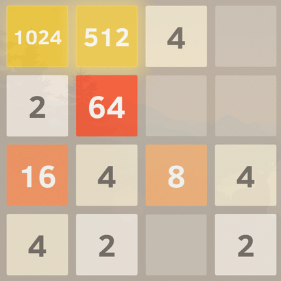

Ultimate 2048 aims to explore and compare the efficacy of various reinforcement learning (RL) algorithms in playing the game 2048, a puzzle game on a 4x4 grid where tiles of equal numbers are merged to create larger tiles until the 2048 tile is reached.  Our focus is to (1) find and optimize an algorithm that can learn to reach the 2048 tile, and (2) perform a comparative analysis of Policy Gradient Algorithms - more specifically, Proximal Policy Optimization (PPO) and Advantage Actor-Critic (A2C) - and Monte Carlo Tree Search (MCTS) for this game under a single, controlled setting.

[]: # (gif credit: https://medium.com/@aswingiftson007/2048-game-in-html-and-javascript-c6cc63d2698f)

<h3 style="color:#ebc02f;">
Source Code
</h3>

View our public repository: [Ultimate 2048 on GitHub](https://github.com/AnthonyCusi/ultimate-2048)

<h3 style="color:#f55d3d;">
Reports
</h3>

View the reports written by our team for CS 175: Project in AI during the Winter 2025 quarter.

- [Proposal](proposal.html)
- [Status](status.html)
- [Final](final.html)

<h3 style="color:#ee9769;">
Team
</h3>

Learn more about our team: [Team Details](team.html)

<h3 style="color:#ece3da;">
Resources
</h3>

Our team used the following resources to better understand the algorithms implemented.

https://www.stephendiehl.com/posts/mtcs/
https://iclr-blog-track.github.io/2022/03/25/ppo-implementation-details/
https://www.geeksforgeeks.org/actor-critic-algorithm-in-reinforcement-learning/
