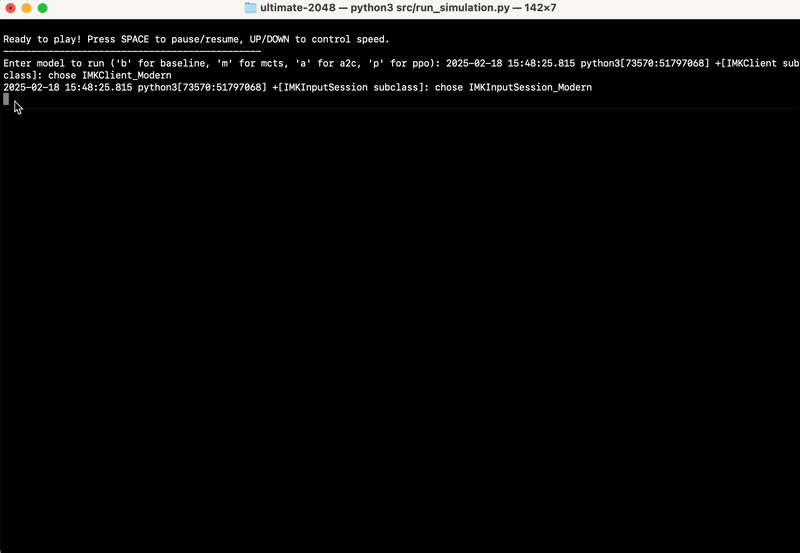
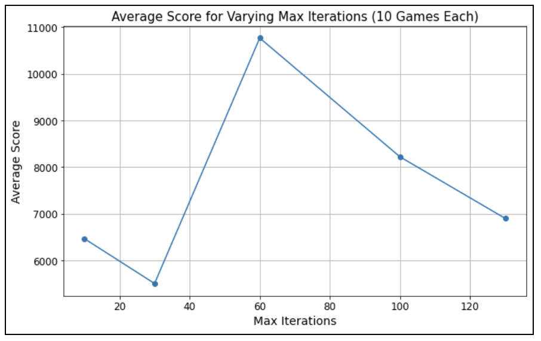
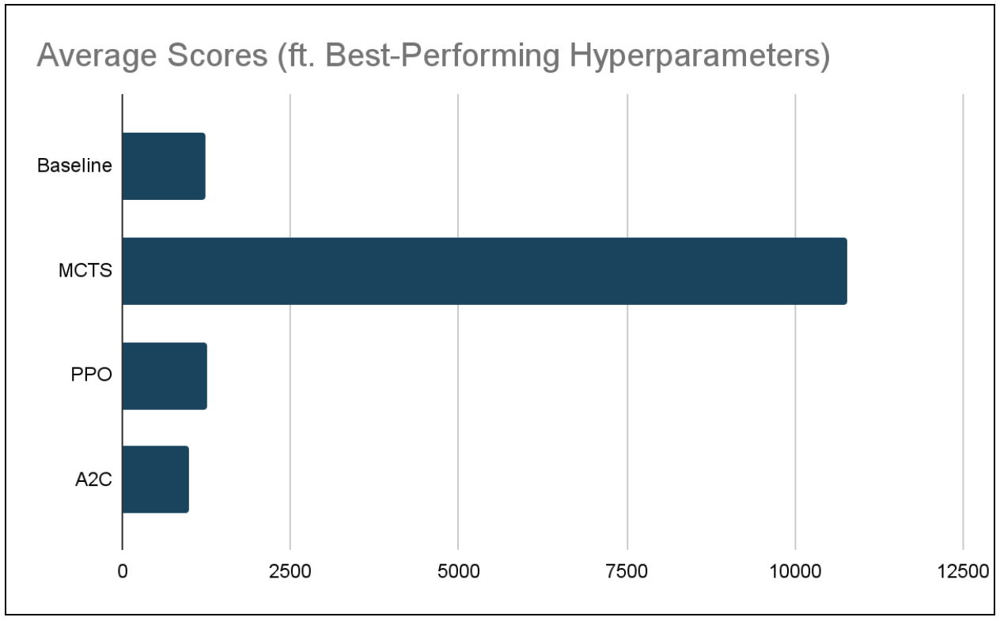

## Video Summary
<iframe width="560" height="315" src="https://www.youtube.com/embed/dJFSMr0Flb8?si=wIHOaOJNEZU4SGls" title="YouTube video player" frameborder="0" allow="accelerometer; autoplay; clipboard-write; encrypted-media; gyroscope; picture-in-picture; web-share" referrerpolicy="strict-origin-when-cross-origin" allowfullscreen></iframe>

## Project Summary
Ultimate 2048 aims to explore and compare the efficacy of various reinforcement learning (RL) algorithms in playing 2048, a puzzle game on a 4x4 grid where tiles of equal numbers are merged to create larger tiles until the 2048 tile is reached. Tiles of values 2 and 4 appear at random in empty spaces on the grid. As there have been a variety of previous attempts across different contexts showing the surprising difficulty of this task, our focus is to (1) find and optimize an algorithm that can learn to reach the 2048 tile, and (2) perform a comparative analysis of Policy Gradient Algorithms - more specifically, Proximal Policy Optimization (PPO) and Advantage Actor-Critic (A2C) - and Monte Carlo Tree Search (MCTS) for this game under a single, controlled setting. We are using a Python implementation of the 2048 game in order to use a 2D array game state as input.  Each time the Python simulation calls the currently in-use model, the model's output consists of two parts: (1) one of four possible next moves: up, down, left, or right and (2) an array of length four with the model's confidence in each move at that particular point in time, expressed as a probability. By conducting this experiment, we hope to discover the strengths and weaknesses of each approach which can inform future studies regarding RL for solving complex puzzles involving randomness.

## Approach
Our approach can be broken down into the implementation and evaluation of three different AI/ML Algorithms, which we evaluate under the same success criteria including the average maximum tile reached, average score achieved across a set of games, and the distribution of maximum tiles reached by each reinforcement learning algorithm.

#### Monte Carlo Tree Search (MCTS)
Monte Carlo Tree Search is a search algorithm that balances exploration (trying new actions to discover long-term strategies) and exploitation (choosing the best-known action based on past experiences). The process follows 4 main steps: selection, expansion, simulation, and backpropagation. For 2048, MCTS constructs a search tree where nodes represent game states, and edges represent moves (up, down, left, right) linking those states. The algorithm iteratively simulates games from different starting points, updating its confidence in the different possible moves to maximize long-term success.

MCTS samples game trajectories by simulating rollouts from the current state. At each step, it selects an action using Upper Confidence Bound for Trees (UCT) (chessprogramming.org). This is defined as:

$$
\mathcal{UCT}(s, a) = Q(s, a)+ C \sqrt{\frac{\ln \mathcal{N}(s)}{\mathcal{N}(s, a)}}
$$

Q(s, a) represents exploitation (favoring high rewards), and the second term encourages exploration (prioritizing less-tried actions). On top of this, we want to ensure that the model keeps the largest tiles in the bottom left corner to keep the board organized. To do this, we first applied a heavy negative coefficient to actions moving right or up to discourage this behavior. Next, we created a distance function measuring how far the largests tile are to the corner with heavy penalties if this distance grows. Therefore, our final equation for selecting the best move from each rollout is:

$$
\mathcal{UCT}(s, a) = Q(s, a) + C \sqrt{\frac{\ln N(s)}{N(s, a)}} - 120000 \cdot (\text{move\_right}) - 20000 \cdot (\text{move\_up}) - 100000 \cdot (\text{dist\_bottom\_left})
$$

To use this model in 2048, we represent states as a 4x4 array and define actions as the 4 possible moves. The reward function incentivizes tile merging and penalizes game termination. Instead of full rollouts, which can be hundreds of moves, we limited each to have a maximum of 35 steps as increasing the number had minimal benefits. We also optimized the number of trials/simulations by finding the average score of 10 games for 10, 30, 60, 100, and 130 simulations for each rollout. We found that using 60 simulations significantly outperformed other values. Additionally, we changed the exploration-expoitation tradeoff constant from 1 to 1.5 to slightly encourage more exploration before choosing the best move (Goenawan, et al. "What’s in a Game: Solving 2048 with Reinforcement Learning").

This setup allowed us to evaluate MCTS's performance for long-term decision making and compare it against other reinforcement-learning approaches for 2048.

#### Proximal Policy Optimization (PPO)
- algorithm summary
- how it samples data
- the equations of the loss(es) it optimizes
- details about the approach as it applies to 2048, such as how you set up inputs and outputs (e.g. states/observations, actions, and rewards)
- how much data you use (e.g. for how many interaction steps you train), and the values of any hyperparameters (cite sources)

#### Advantage Actor-Critic (A2C)
Actor-Critic algorithms are reinforcement learning algorithms that amalgamate both policy-based methods (which serve as the "Actor") and value-based methods (which serve as the "Critic").  Essentially, the Actor makes decisions while the Critic critiques them.  The "advantage" aspect of A2C occurs when an advantage function is included, which helps to determine how much better a decision by the Actor is in comparison to an "average" decision in the current state. (Geeks for Geeks)

Our A2C model implementation samples data by taking in the current game state each time it is called to make a move.  This state is a Python array representing the current tiled 2048 board.  Given this game state, the actor returns the probability of success for each move.  Ideally, we would then sample over the probability distribution using np.random.choice.  However, we ran into an issue where our agent would pick a move that is not currently possible in the game state.  To alleviate this, we are currently choosing the move with the maximum probability of success of all current possible moves in the game state.  We plan on fixing this sampling issue before the final report.

Our A2C model optimizes the following loss equation for the Actor by using the advantage function A(s, a).  (Equation via Medium.com)

$$
\mathcal{L}_{actor} = -E_{\pi_\theta} \left[ \log \pi_\theta(a | s) \cdot A(s, a) \right]
$$

Our A2C model optimizes the following loss equation for the Critic by minimizing the Mean Squared Error (MSE) between what is predicted and the target value (V). (Equation via Medium.com)

$$
\mathcal{L}_{critic} = \frac{1}{2} E \left[ \left( R_t + \gamma V(s_{t+1}) - V(s_t) \right)^2 \right]
$$

Our A2C model is very similar to our other two models in the way that it applies to 2048.  As stated above, our game state is a 4x4 grid represented as a Python array.  In order to make this compatible with neural networks for the Actor and Critic building step in this particular algorithm, we preprocess this grid into a (4,4,1) tensor.  The possible actions are the same for A2C as they are in all implementations of the 2048 game: up, down, left, right.  Like our other models, A2C returns an array representing the probability distribution over these moves.  This is done by our Actor neural network.  Rewards are given based on the increase in overall game score between moves.

Finally, our A2C model uses several different data point in order to make its decisions.  At this point in time, we are messing around with training it for 5-50 episodes between each new move.  We are still learning how to use A2C for 2048, but ideally will have each episode train until the 2048 game is over.  We plan on implementing this before the final report.  While we are actively testing different values for them in order to produce more optimal results, our current hyperparameters are as follows: discount factor (gamma): 0.99 (we have seen this gamma rate used as common practice in several other RL contexts) ("The discount factor gamma is also a value between 0 and 1 but is typically kept high" (Oracle AI & Data Science Blog)), learning rate (Actor and Critic): 0.003 (we tested several different learning rates as this hyperparameter seemed to have the biggest affect on the score; at this point, 0.003 has resulted in the best performance).  Our evaluation section and video summary talk more about this hyperparameter tuning.

## Evaluation
Before we get into the way we evaluate our project, here's a little sneak peak into how we run our game and models:

1. Run our run_simulation.py file with Python3.
2. Choose which model we'd like to run the game on: "Enter model to run ('b' for baseline, 'm' for mcts, 'a' for a2c, 'p' for ppo)".
3. Observe as our model runs on a game of 2048.
4. View the output results in the terminal: the final score, the maximum tile, and the moves made.

The gifs below provide a visual insight into the start, middle, and end of an example game.

At this point in time, we are evaluating the success of our model's results based primarily on the score achieved by the end of the game.  While the average maximum tile reached is another significant point of data, this is factored into the score, and games can end with the same maximum tile and vastly different score.

Thus, we used the game score to determine how to tune our models' hyperparameters.

#### Monte Carlo Tree Search (MCTS)
For MCTS, we determined through trial and error that tuning the maximum iterations of random plays made the biggest difference in score.  Thus, we focused on this hyperparameter.  After choosing 5 different potential values for max iterations: 10, 30, 60, 100, and 130, we ran the game 10x for each max iteration, then averaged the scores for each.  Our MCTS model performed best (average score of 10768.8) with max iterations set to 60.

#### Proximal Policy Optimization (PPO)
For PPO, we determined through trial and error that tuning the generalized advantage estimator (GAE) lambda made the biggest difference in score.  Thus, we focused on this hyperparameter.  After choosing 5 different potential values for GAE lambda: 0.90, 0.94, 0.95, 0.96, 0.99, we ran the game 10x for each GAE lambda, then averaged the scores for each.  Our PPO model performed best (average score of 1266) with a GAE lambda of 0.95.

#### Advantage Actor-Critic (A2C)
For A2C, we determined through trial and error that tuning the learning rate made the biggest difference in score.  Thus, we focused on this hyperparameter.  After choosing 5 different potential values for learning rate: 0.001, 0.003, 0.006, 0.01, and 0.013, we ran the game 10x for each learning rate, then averaged the scores for each.  Our A2C model performed best (average score of 984) with a learning rate of 0.003.

#### Findings
We ran each of our models - MCTS, PPO, and A2C - as well as the randomized baseline, 10 times each with their respective best performing hyperparameters in order to determine which model is, at this time, best suited for the task of solving 2048.  The average scores are visable in the following table.

At this point in time, it appears that MCTS is by far the best suited RL algorithm for this particular problem.  While our PPO and A2C models are functional, they perform just around the baseline.

## Remaining Goals and Challenges
At this point in time, only one of our three models has been able to reach the tile 2048.  This model, MCTS, is not able to achieve this score consistently.  Thus, while we are excited to reach this benchmark, we aim for it to no longer be a rare outcome.  Ideally, we want to reach 2048 with at least one of our models ~5% or more of the time.  Furthermore, we are still extremely far off from our moonshot of reaching the 4096 tile.  If we could hit this tile just once, we would consider our implementation a huge success.

We will continue to optimize hyperparameters and rewards in order to make higher scores more consistent.  One of the things we plan to try is using the board sum instead of the score to choose the next best move.

A direct and comprehensive comparison between models will be made and evaluated once they are fully optimized.  We plan to use quantitative metrics including the average maximum tile reached, average score achieved across a set of games, and the distribution of maximum tiles reached in order to complete our evaluations.

We do not anticipate facing formidable obstacles during the remainder of our project.  At this point in time, we have a functioning game simulation, a reliable baseline, and three functioning models to continue to build upon.  When we do face minor challenges, as we have throughout the development up to this point, we will face them with online research, team discussions, and trial and error.

## Resources Used
General Python Libraries: concurrent, copy, json, os, Pygame, random, sys

AI/ML/Computing Libraries: Keras, Matplotlib, NumPy, TensorFlow

2048 in Python:
- Game Logic/Rendering (game_logic.py, game_renderer.py): https://github.com/scar17off/ai-2048
- 2048 Python Game Simulation (run_simulation.py): Modified version of the original file "ai_play.py" in https://github.com/scar17off/ai-2048/tree/main

Algorithm Implementation Approaches:
- Monte Carlo Tree Search (MCTS) approach (mcts.py): inspired by the implementation for Tic-Tac-Toe at https://www.stephendiehl.com/posts/mtcs/
- Proximal Policy Optimization (PPO) approach (ppo.py): inspired by the implementation of PPO at https://iclr-blog-track.github.io/2022/03/25/ppo-implementation-details/
- Advantage Actor-Critic (A2C) approach (a2c.py): inspired by the implementation for CartPole at https://www.geeksforgeeks.org/actor-critic-algorithm-in-reinforcement-learning/

Other Resources:
- https://blogs.oracle.com/ai-and-datascience/post/reinforcement-learning-q-learning-made-simple
- https://medium.com/@dixitaniket76/advantage-actor-critic-a2c-algorithm-explained-and-implemented-in-pytorch-dc3354b60b50

AI Tools:
- Used ChatGPT in line with other online resources to gain a better understanding of the algorithms before implementation (i.e. had the chatbot summarize, give use case examples, etc.)
- Used ChatGPT to aid in the fixing of minor bugs during implementation process

